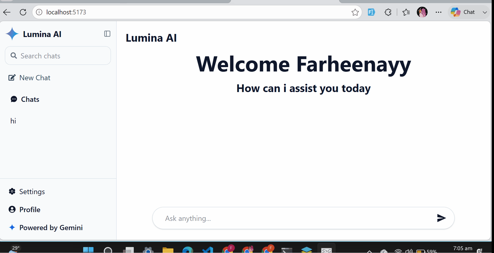
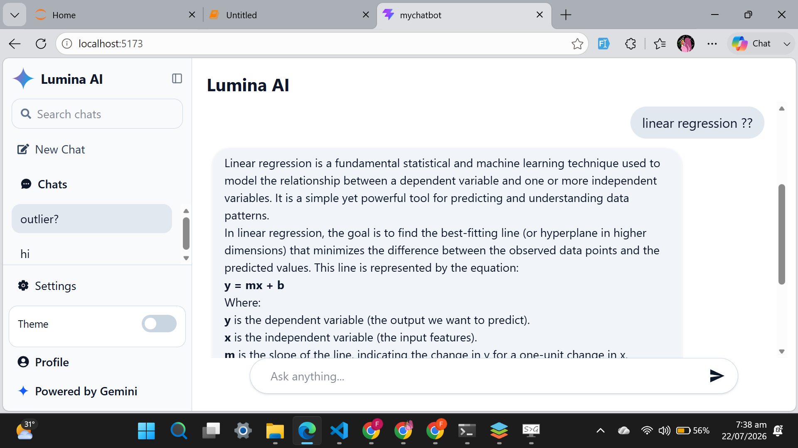
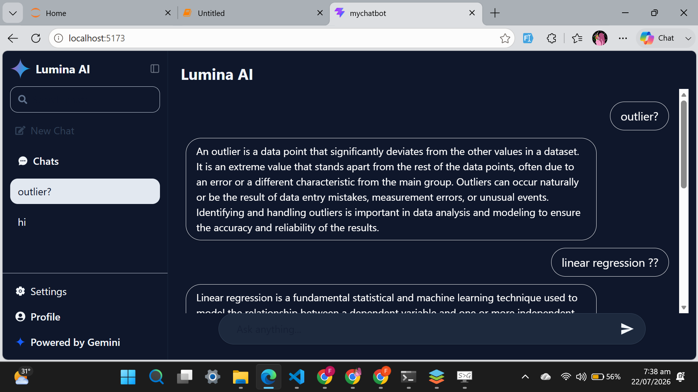

# 🤖 Lumina AI Chatbot

A modern AI chatbot built with **React**, **Vite**, **Tailwind CSS**, and the **Google Gemini API**/**Cohere API**. Lumina AI provides a clean ChatGPT-inspired interface with persistent chat history, theme switching, responsive design, and real-time AI conversations.

---

## 🚀 Live Demo

🔗 **Live Website:** https://your-live-link.vercel.app


---

## 🎥 Demo



## 📸 Screenshots

## Light Mode

<p align="center">
  
</p>

## Dark Mode

<p align="center">
  
</p>


---

## ✨ Features

- 💬 Real-time AI conversations using Google Gemini API
- 📝 Persistent chat history with Local Storage
- 🔍 Search previous conversations
- ➕ Create multiple chat sessions
- 📂 Switch between previous chats
- 🌙 Light & Dark mode
- 📱 Fully responsive design
- ⌨️ Send messages using Enter key
- ⏳ Loading animation while AI generates a response
- 🏷️ Automatic chat title generation
- 🎨 Modern ChatGPT-inspired UI

---

## 🛠️ Tech Stack

### Frontend

- React.js
- Vite
- Tailwind CSS
- Axios
- React Icons

### API

- Google Gemini API
- Cohere API

### Storage

- Local Storage

---

## 📂 Project Structure

```text
src/
│── assets/
│── components/
│   ├── AiMsg.jsx
│   ├── ChatArea.jsx
│   ├── Header.jsx
│   ├── Input.jsx
│   ├── LoadingAnimation.jsx
│   ├── Sidebar.jsx
│   ├── UserMsg.jsx
│   └── WelcomeArea.jsx
│
├── App.jsx
├── main.jsx
└── index.css
```

---

## ⚙️ Installation

Clone the repository

```bash
git clone https://github.com/farheenayy33/Lumina-AI-Chatbot.git
```

Move into the project

```bash
cd lumina-ai-chatbot
```

Install dependencies

```bash
npm install
```

Create a `.env` file

```env
VITE_CHATBOT_API=YOUR_GEMINI_API_KEY
```

Start the development server

```bash
npm run dev
```

---

## 📦 Build

```bash
npm run build
```

---

## 🔐 Environment Variables

This project requires a Gemini API key.

```env
VITE_CHATBOT_API=YOUR_API_KEY
```

The `.env` file is ignored by Git and should never be committed.

---

## 🎯 Future Improvements

- Edit user message
- Cloud database for chat history
- Voice input
- Image generation
- Markdown support
- File upload support
- Export chat as PDF
- Streaming AI responses

---

## 👩‍💻 Author

<p align='center'><strong>Farheen Laraib</strong></p>


GitHub:
https://github.com/farheenayy33

LinkedIn:
www.linkedin.com/in/farheen-laraib-943ba9404

Portfolio:
https://portfolio-ruddy-five-80.vercel.app/

---

